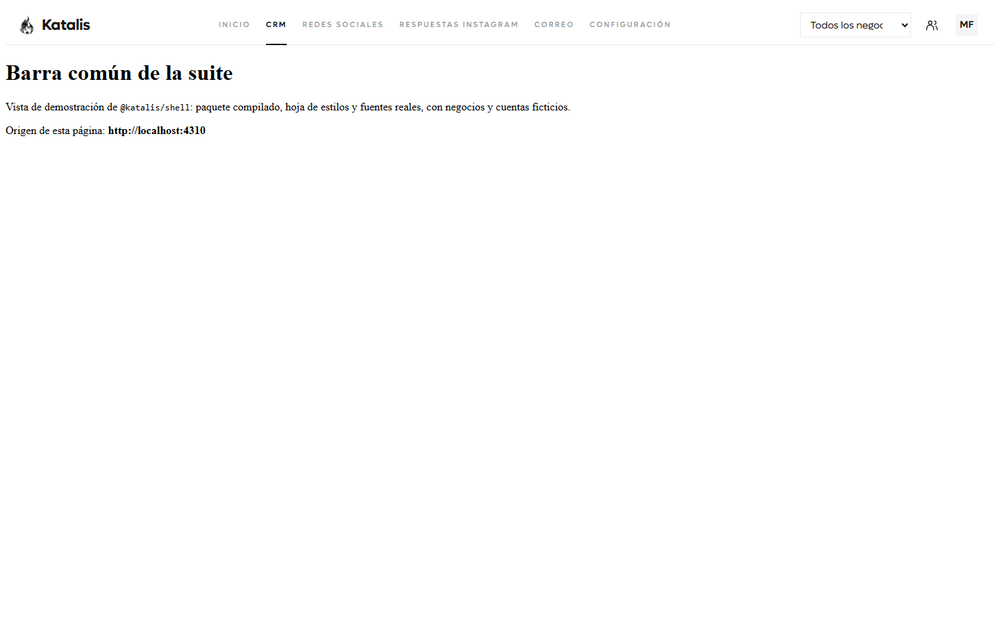
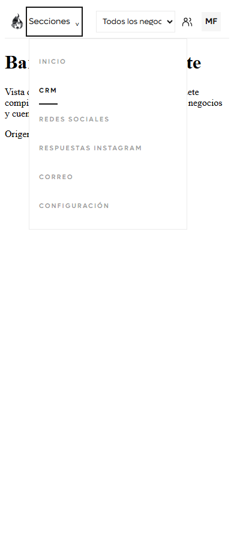

# @katalis/shell

Barra común de Katalis para React 19. No depende de Next.js, Tailwind ni un router.
El CSS consume `@katalis/ui-tokens` v0.1.0. La barra usa Lufga, conserva esquinas rectas y adapta su altura. No restes una altura fija al contenido.
Instala los tokens explícitamente en cada aplicación; son una dependencia par, igual que React.

```tsx
import { KatalisShell, createSections, OPERATIONAL_SECTION_IDS, useKatalisBusinessContext } from '@katalis/shell';
import '@katalis/shell/styles.css';

function Navigation({ links, user }) {
  const business = useKatalisBusinessContext();
  return (
    <KatalisShell
      sections={createSections(links, business.value, { visibleSections: OPERATIONAL_SECTION_IDS })}
      current="crm"
      business={business}
      user={user}
    />
  );
}
```

| Prop | Contrato |
| --- | --- |
| `sections` | Lista `{ id, label, href }`. IDs: `home`, `crm`, `social`, `replies`, `mail`, `ads`, `settings`. |
| `current` | ID de la sección activa. Usa tinta y subrayado de 2 px. |
| `business` | `{ value, options: [{ id, label }], onChange }`. Estado controlado por la aplicación. |
| `user` | `{ name, email, avatarUrl?, onSignOut }`. El callback cierra la sesión en la aplicación anfitriona. |
| `signInHref` | Enlace de acceso cuando `user` está ausente. El hub usa el acceso del CRM. |
| `contactsHref` | Acceso directo «Contactos de Instagram»; icono con nombre accesible y texto desde 1600 px. |
| `contentId` | ID del contenido para el enlace accesible. Predeterminado: `katalis-content`. |

El ejemplo Navigation debe estar dentro de KatalisBusinessProvider con el catálogo explícito del CRM. El hook de contexto consume ese catálogo; llamar al hook independiente sin catálogo puede recuperar el fallback de desarrollo.

`links` es un objeto con los siete IDs y enlaces HTTP/HTTPS absolutos.
`createSections(links, businessId, options)` acepta un tercer argumento opcional.
Sin él devuelve las siete secciones en orden canónico, como antes.
Con `{ visibleSections }` devuelve solo esos IDs, en orden canónico y sin duplicados; una lista vacía no dibuja ninguna.
`OPERATIONAL_SECTION_IDS` es la lista operativa: `home`, `crm`, `social`, `replies`, `mail`, `settings`.
`ads` sigue en los tipos y en las etiquetas para no romper a quien ya lo pasa, pero no entra en la navegación operativa.
Etiquetas visibles: Inicio, CRM, Redes sociales, Respuestas Instagram, Correo y Configuración.
`createSections` conserva rutas, parámetros y fragmentos; `#` desactiva una sección pendiente, como Ads.
Un negocio explícito y `all` sustituyen el `negocio` anterior con una sola ocurrencia.
`all` viaja escrito: quien lee la barra consulta el almacenamiento local del origen cuando falta el parámetro, así que borrarlo resucitaría una selección vieja en el destino. Una entrada vacía o ausente no toca el negocio del destino.
CRM: `http://localhost:3000` o `https://crm.katalis.dev`.
Social: `http://localhost:4200` o `https://social.katalis.dev`.
Respuestas IG: `https://openreply.katalis.dev`.
Correo: `https://mail.katalis.dev`, pendiente (`#`) hasta que el servicio esté desplegado.
Configuración usa el enlace absoluto del CRM terminado en `/settings`.
Inicio apunta a `https://katalis.dev` o al hub local en `http://localhost:4300`.

El catálogo lo publica el CRM. `KatalisBusinessProvider` recibe `{ options: [{ id, label, groupId?, groupLabel? }] }` y es la autoridad; la lista que trae el paquete es solo un respaldo de desarrollo y ninguna interfaz debe tratarla como catálogo real.
`useKatalisBusiness` conserva la selección en almacenamiento local y la transfiere mediante el parámetro `negocio` al navegar.
Usa la clave `katalis.business`. El almacenamiento es por origen; el parámetro `negocio` transfiere la selección entre subdominios.
El hook devuelve `ready` después de hidratar y acepta un callback opcional para cambios del selector.
Cada aplicación aplica sus filtros. El CRM usa la selección como filtro inicial de Negocio en Contactos.
La selección no concede permisos ni crea organizaciones.
La autenticación y las integraciones de datos pertenecen a cada aplicación. Este paquete no implementa login único.

Importa el CSS una vez desde el layout raíz. CRM, Postiz y OpenReply montan la barra en su zona autenticada.
El hub también monta la barra sin sesión, con el enlace Entrar.
Asigna el espacio restante al contenido con flex y `min-height: 0` para evitar doble scroll.
La barra se adapta sin cambiar de diseño: por debajo de 900 px la navegación vive en el desplegable Secciones; entre 900 y 1199 px la navegación ocupa una segunda fila y la barra crece; desde 1200 px vuelve a una sola fila cuando cabe.
La segunda fila hace que la barra mida más de 56 px en ese rango: un consumidor que reste una altura fija al contenido debe usar flex, no una resta.
Los valores largos del selector solo se truncan en pantalla; su nombre accesible no cambia.
Escape cierra los desplegables y el enlace Saltar al contenido apunta a `contentId`.
La barra usa enlaces nativos, foco visible y movimiento reducido. No contiene una acción primaria.
Las microcaps inactivas siguen el requisito explícito de tinta al 40 %, que prevalece sobre K6 en esta barra.

## Capturas

Las capturas de escritorio y móvil se generan con datos de demostración, sin datos del CRM.




## Desarrollo

```sh
bun install
bun run build
bun run check-types
bun test
```

Vista de demostración, con datos ficticios y sin servicios reales:

```sh
bun run build
bun run preview:build
bun run preview:serve        # http://localhost:4310
bun run preview:serve-b      # http://127.0.0.1:4311, el segundo origen
```

El fixture carga el paquete compilado (`dist`), la hoja `styles.css` y las fuentes reales.
`?compatibilidad=1` añade una segunda barra con las siete secciones para comprobar la compatibilidad.
La salida se ejercita contra el servidor local: `/api/salida` responde 200 y `/api/salida-fallida` responde 500.

Se publica `dist` compilado para que las dependencias git no necesiten scripts de instalación.
No muevas una etiqueta publicada. Crea una nueva versión para cualquier cambio posterior.

La versión 0.1.1 añade `main` y `types` para TypeScript con resolución `node` en Postiz.
Conserva los exports modernos y el mismo código y CSS de 0.1.0.
La versión 0.1.2 declara los tokens como dependencia par para evitar duplicados de Git en Bun 1.3.12.
La versión 0.1.3 conserva el negocio recibido por enlace al continuar por las rutas internas de otra aplicación.
La versión 0.2.0 añade el umbral de 900 px, Todos los negocios, callback, estado de hidratación, acceso sin sesión y atajo de contactos.
`openReplyContactsHref` recibe la URL del espacio CRM, por ejemplo `https://crm.katalis.dev/katalis`, y conserva el filtro `source=OPENREPLY`.
La versión 0.5.0 añade la sección **Correo** (`mail`) entre Respuestas IG y Ads. El consumidor decide si está lista: `#` la deja pendiente y la barra la dibuja desactivada con «próximamente», como Ads.
La versión 0.6.0 añade el tercer argumento de `createSections` y `OPERATIONAL_SECTION_IDS`, traduce las etiquetas a Redes sociales y Respuestas Instagram, renombra el atajo a Contactos de Instagram y ajusta el responsive a segunda fila entre 900 y 1199 px.
`all` deja de borrarse: viaja explícito como `negocio=all` para que el destino no recupere una selección guardada. Es un cambio de comportamiento deliberado, no una compatibilidad byte a byte.

## Identidad única (v0.3.0)

Las cuatro apps pasan `signOutUrl="https://api.crm.katalis.dev/api/auth/sign-out"`.
El menú «Salir» hace POST con cookies y vuelve a `https://katalis.dev/` solo si el CRM confirma la salida. Ante un fallo conserva la página y permite reintentar.
`user.onSignOut` queda como compatibilidad para desarrollo; no se usa en la suite desplegada.
